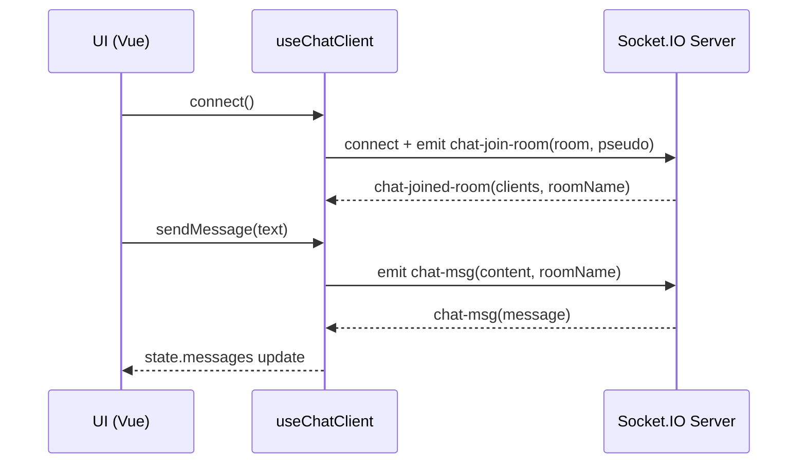

# M1-pwa-nuxt — PWA Chat (Nuxt 4 + TypeScript)

Client PWA de messagerie instantanée en **TypeScript** basé sur **Nuxt 4**, compatible **offline**, utilisant **Socket.IO** pour les rooms et les messages, et intégrant des APIs PWA (caméra, notifications, batterie, etc.).

> Démo (VPS) : https://vps115467.serveur-vps.net

---

## Sommaire
- [Objectifs et consignes](#objectifs-et-consignes)
- [Fonctionnalités](#fonctionnalités)
- [Sitemap](#sitemap)
- [Stack technique](#stack-technique)
- [Architecture du projet](#architecture-du-projet)
- [Variables d’environnement](#variables-denvironnement)
- [Installation & exécution en local](#installation--exécution-en-local)
- [Mode offline](#mode-offline)
- [PWA](#pwa)
- [Déploiement (Docker + DockerHub + VPS)](#déploiement-docker--dockerhub--vps)
- [HTTPS (Certbot)](#https-certbot)
- [Tests](#tests)
- [Troubleshooting](#troubleshooting)
- [Crédits](#crédits)

---

## Objectifs et consignes

**TP Progressive Web Application (© 2026 Anjou Soft)**

- Réaliser une **PWA** (manifest + HTTPS obligatoire)
- Client de **messagerie instantanée** en **TypeScript**
- Support **offline** : historique, pièces jointes, gestion profil, se désinscrire d’une conversation
- Support **online** : créer / rejoindre des rooms
- APIs PWA :
  - caméra (prise de photo)
  - notifications
  - mode offline + cache
  - stockage local (conversations + photos)
  - indicateur batterie
  - vibration
  - appel téléphonique
- Mise en production sur un **VPS** (CI/CD + Docker)
- Documentation (Markdown, Mermaid) + fichier dédié au **rendering SSR/SSG/ISR** : [`docs/rendering.md`](docs/rendering.md)
- Tests unitaires, composants, e2e

---

## Fonctionnalités

### Online
- Connexion à un serveur de chat **Socket.IO**
- Liste des rooms disponibles
- Rejoindre une room existante
- Envoyer / recevoir des messages
- Gestion d’événements (connexion/déconnexion, infos, images)
- Upload / affichage de pièces jointes (images)

### Offline
- Créer / modifier sa fiche utilisateur (pseudo + photo) *(stockée localement)*
- Consulter l’historique des conversations précédentes
- Consulter les pièces jointes déjà reçues (si présentes en cache/localStorage)
- Se désinscrire d’une conversation *(côté client, persistance locale)*

### APIs PWA
- 📷 **Caméra** : prise de photo (pièce jointe)
- 🔔 **Notifications système** (type “Teams”) quand tu es connecté à une room
- 📳 **Vibration** lors de certaines notifications (mobile)
- 🔋 **Batterie** : affichage niveau / état (si support navigateur)
- 📞 **Appel** : lien `tel:` (mobile)

---

## Sitemap

- `/` **home** : présentation du projet + technologies + boutons PWA (ex: activer notifs)
- `/reception` : pseudo + photo + liste des rooms
- `/chat` ou `/room` : salle de tchat (historique, envoi, photo)
- `/gallery` : galerie des photos prises / reçues

> À adapter si tes routes réelles diffèrent (Nuxt génère selon `pages/`).

---

## Stack technique

- **Nuxt 4** (Vue 3) + **TypeScript**
- **Vite** + `@vite-pwa/nuxt` (Service Worker, manifest, Workbox)
- **socket.io-client** (temps réel)
- Stockage offline : `localStorage` (messages + métadonnées)
- Déploiement : **Docker**, **DockerHub**, **GitHub Actions**, **VPS Debian**

---

## Architecture du projet

### Dossiers principaux
- `app/pages/` : routes (home, reception, chat/room, gallery)
- `app/components/` : UI (NavBar, composants chat, etc.)
- `app/composables/` : logique réutilisable (chat client, batterie, notifications, etc.)
- `app/plugins/` : injection `$socket` (Socket.IO) côté client
- `public/` : assets publics (icônes PWA, etc.)
- `nuxt.config.ts` : config Nuxt + PWA + runtimeConfig

### Flux temps réel (Socket.IO)



---

## Variables d’environnement

Le projet utilise `runtimeConfig.public` via Nuxt (préfixe `NUXT_PUBLIC_...`).

Exemple `.env` :

```bash
NUXT_PUBLIC_CHAT_SERVER=https://api.tools.gavago.fr
NUXT_PUBLIC_CHAT_SOCKET_PATH=/socket.io
NUXT_PUBLIC_API_BASE=https://api.tools.gavago.fr/socketio/api
```

⚠️ Si `NUXT_PUBLIC_CHAT_SERVER` est vide, le client Socket échoue (warning console).

---

## Installation & exécution en local

### Prérequis
- Node.js 22
- npm

### Installation
```bash
npm ci
```

### Lancement dev
```bash
npm run dev
```

### Build + preview
```bash
npm run build
npm run preview
```

---

## Mode offline

### Stockage local
- Messages : `localStorage` (ex: clé `chat:messages:v1`)
- Pièces jointes : selon implémentation (base64 / URLs / cache SW)

### Tester l’offline
1. Ouvrir l’app
2. Ouvrir DevTools → Application → Service Workers (si besoin)
3. DevTools → Network → cocher **Offline**
4. Vérifier :
   - lecture historique (messages)
   - lecture pièces jointes déjà chargées
   - profil utilisateur (pseudo/photo)

---

## PWA

### Manifest
- Déclaré via `@vite-pwa/nuxt`
- Icônes dans `public/icons/`

### Installation
- Chrome / Edge : “Installer l’application”
- Mobile : “Ajouter à l’écran d’accueil” (selon OS)

### Service Worker / Workbox
- Cache assets Nuxt (`/_nuxt/`)
- Cache pages / assets statiques selon règles Workbox
- Nettoyage caches obsolètes

---

## Déploiement (Docker + DockerHub + VPS)

### Principe
- GitHub Actions build l’image Docker et la push sur DockerHub
- Le job “deploy” se connecte en SSH au VPS et fait :
  - `docker compose pull`
  - `docker compose up -d --force-recreate`

### Docker Compose (base)
Exemple (HTTP simple) :

```yaml
services:
  nuxt:
    image: euge36l/m1-pwa-nuxt:latest
    container_name: m1-pwa-nuxt
    restart: unless-stopped
    env_file:
      - .env
    ports:
      - "80:3000"
```

Pour HTTPS, voir section **HTTPS (Certbot)**.

### CI/CD (GitHub Actions)
Secrets typiques :
- `DOCKERHUB_USERNAME`
- `DOCKERHUB_TOKEN` (PAT avec droits push/pull sur le repo)
- `VPS_IP`
- `VPS_USER`
- `VPS_SSH_KEY` (clé privée SSH)
- `VPS_ENV` (contenu du `.env` si tu le génères en CI)

Workflow :
- build & push tags : `latest` et `${{ github.sha }}`
- deploy : pull + up sur VPS

---

## HTTPS (Certbot)

Exigence PWA : **HTTPS obligatoire**.

Tu peux gérer TLS sans Nginx via un reverse proxy (ex: HAProxy) + Certbot.

Étapes (résumé) :
1. Exposer 80 (challenge HTTP-01 Let’s Encrypt)
2. Certbot récupère le certificat pour `vps115467.serveur-vps.net`
3. Le proxy TLS sert 443 et reverse-proxy vers le conteneur Nuxt (port 3000)
4. Renouvellement auto (cron/loop) + hook pour recharger le certificat

⚠️ Si Chrome affiche “non sécurisé” malgré un certificat valide : vérifier le **mixed content**
(WebSocket en `ws://` au lieu de `wss://`, images `http://`, etc.).

---

## Tests

À implémenter / compléter selon l’état du projet.

- Unitaires : Vitest
- Composants / Design System : Storybook
- End-to-End : Playwright

Commandes recommandées (si configurées) :

```bash
npm run test
npm run storybook
npm run e2e
```

---

## Troubleshooting

### “NUXT_PUBLIC_CHAT_SERVER is empty”
- Vérifier `.env` sur la machine/containeur
- Vérifier que Nuxt charge bien les variables (`runtimeConfig`)
- En Docker : `docker exec -it <container> env | grep NUXT_PUBLIC`

### WebSocket / Socket.IO en production
- Assurer que la connexion utilise bien `wss://` derrière HTTPS
- Vérifier path Socket (`/socket.io`) et CORS côté serveur

### Offline / SW
- DevTools → Application → “Unregister service worker” si cache “bloqué”
- Hard reload

---

## Crédits
- TP PWA — © 2026 Anjou Soft
- Références : https://whatpwacando.today
